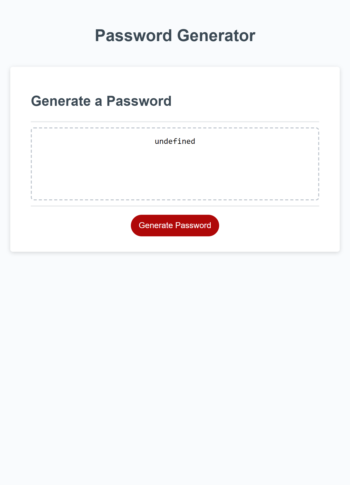

# random-password-generator

## Description

I needed to create a random password generator that prompts the user to input certain criteria such as the password length, whether or not to include uppercase characters, lowercase characters, numbers, and special characters.

## Acceptance Criteria
Ask user for password length.
Ask user if they would like to include uppercase characters.
Ask user if they would like to include lowercase characters.
Ask user if they would like to include numbers.
Ask user if they would like to include special characters.
The input from the user should be validated to match their selection.
The password is then generated based on that criteria.

## Work Completed

Added prompt for password length.
Added prompt for character criteria.
If length is too short or too long the program restarts.
If no character criteria is chosen the program restarts.

## Website Link

https://iqwixn.github.io/random-password-generator/

## Website screenshot

